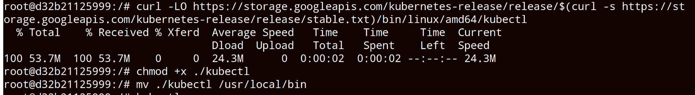
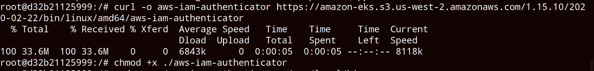
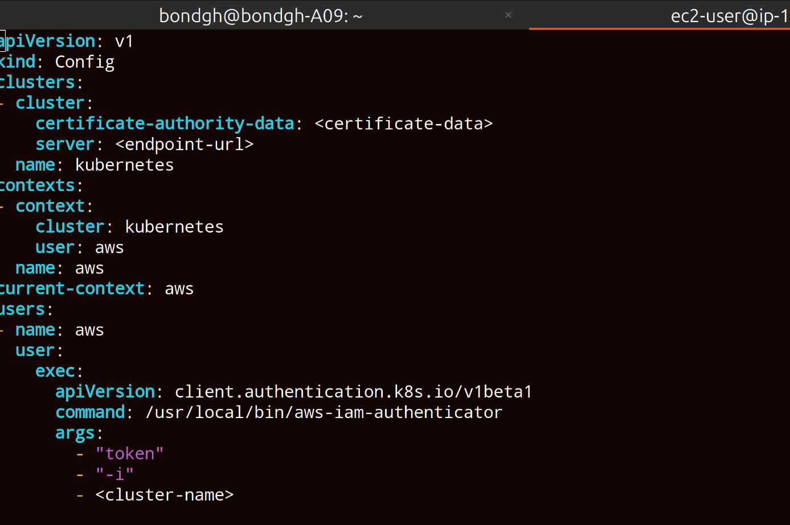

<h1>Deploy from Jenkins to EKS cluster</h1>
<h2>Technologies used</h2>

- <b>Kubernetes</b> 
- <b>AWS EKS</b>
- <b>Jenkins</b>
- <b>Docker<b/>
- <b>Linux<b/>

<h2>Detailed Description of Project </h2>
1. Install kubectl and aws-am-authenticator on a Jenkins server 
2. Create kubeconfig file to connect to EKS cluster and add it on Jenkins server 
3. Add AWS credentials on Jenkins for AWS account authentication 
4. Extend and adjust Jenkinsfile of the previous CI/CD pipeline to configure connection to EKS cluster 

   

   <h2>step 1    Install kubectl and aws-iam-authenticator on a jenkins server</h2>
      NB: Jenkins container is already running on a server 
   ssh into jenkins container as root user ( docker exec -u 0 -it containerNo bash) 
   install kubectl  
   check documentation for installation:  
   add execution permission to ./kubectl   
   move ./kubectl to local folder  

          curl -LO https://storage.googleapis.com/kubernetes-release/release/$(curl -s https://storage.googleapis.com/kubernetes-release/release/stable.txt)/           bin/linux/amd64/kubectl; chmod +x ./kubectl; mv ./kubectl /usr/local/bin/kubectl

  
   

   

   install aws-iam-authenticator in jenkins container    
   check documentation for installation guide   

   download using curl command    

      curl -Lo aws-iam-authenticator https://github.com/kubernetes-sigs/aws-iam-authenticator/releases/download/v0.6.11/aws-iam-                       authenticator_0.6.11_linux_amd64
      chmod +x ./aws-iam-authenticator
      mv ./aws-iam-authenticator /usr/local/bin

   
   
   

 

   <h2>step 2  Create kubeconfig file to connect to EKS cluster and add it on Jenkins server</h2>

     Create a kubeconfig file to connect to EKS cluster 
     1. add your cluster name  
     2. add the cluster endpoint 
     3. add certificate-authority-data from cluster kubeconfig file
    
  
   

  Create a ".kube" directory in the "/var/jenkins_home/" directory and copy the config file to this directory  

    docker cp config containerNumber:/var/jenkins_home/.kube/      

  

   <h2>step 3 Add AWS credentials on Jenkins for AWS account authentication</h2>

   Create creadentials in Jenkins  with type "secret text"   
   use the credentials from ".aws/credentials" in your home directory   
   

    
   

 
   
   

   <h2>step 4  Extend and adjust Jenkinsfile of the previous CI/CD pipeline to configure connection to EKS cluster</h2>

   Set the created credentials in Jenkins as environmental variables in Jenkinsfile   
             environment {
                 AWS_ACCESS_KEY = credentialsId("nameOfId")
                 AWS_SECRET_KEY = credentialsId("nameOFId")
              }
  
   

   

    

   

 
     

